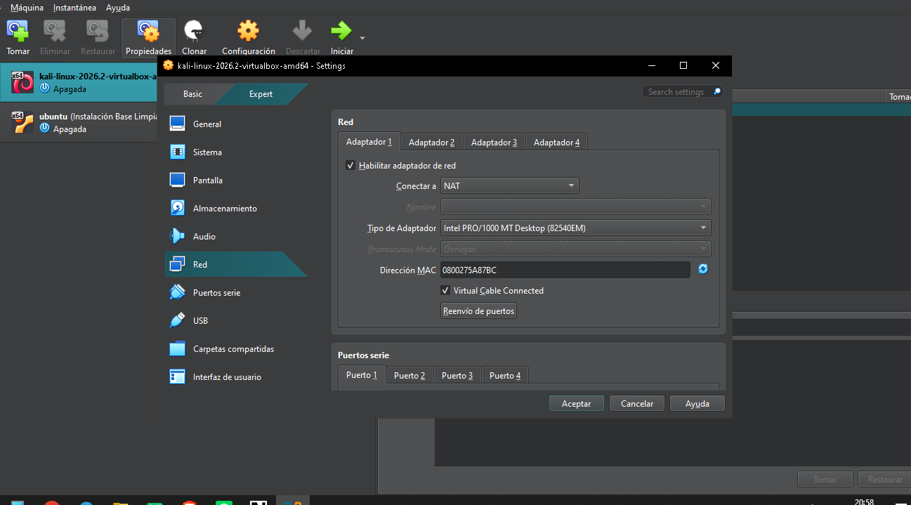
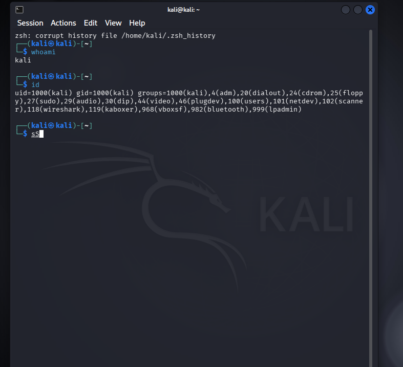
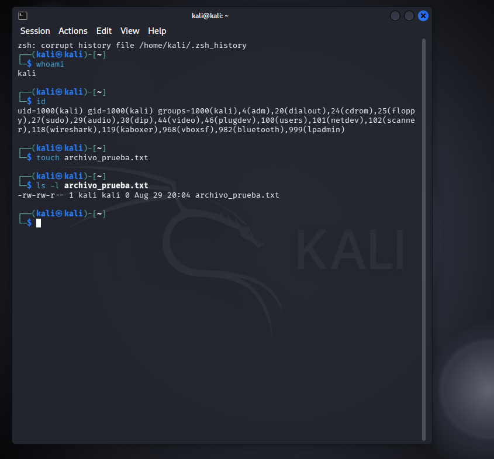
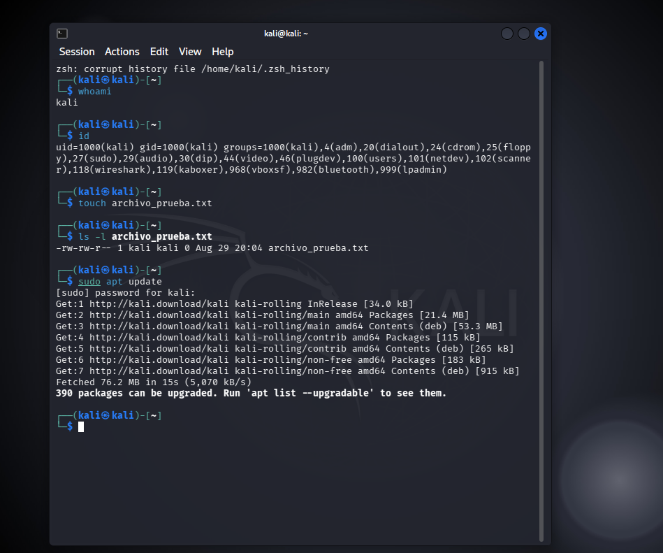
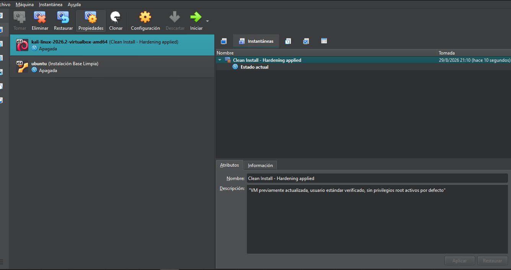

# laboratorio-seguro-ciberseguridad

# Reporte Técnico de Configuración de Laboratorio Seguro de Ciberseguridad
 
**Máquina de Prácticas:** Kali Linux

 
## 1. La Fundación: VirtualBox y Red Aislada
 

 
La Máquina Virtual está configurada con el **Adaptador 1 en modo NAT**. Elegí este modo (en lugar de "Bridge"/Puente) porque NAT hace que la VM salga a internet utilizando la dirección IP del equipo Host, pero **no le asigna una IP visible dentro de la red local** (Wi-Fi de casa/oficina). Esto significa que ningún otro dispositivo de la red puede iniciar una conexión directa hacia la VM ni detectarla como un host independiente.
 
Esto es clave para un laboratorio de ciberseguridad: en el futuro voy a instalar y probar herramientas de pentesting, escaneo de puertos, tráfico malicioso simulado, etc. Si la VM estuviera en modo Puente, sería un dispositivo más expuesto en la red doméstica, visible y potencialmente vulnerable frente a otros equipos conectados a la misma red (o incluso frente a un atacante externo si la red no está bien protegida). Con NAT, la VM queda aislada detrás del Host, que actúa como una capa adicional de protección.
 
---
 
## 2. Capa Linux: Usuario Estándar
 

 
Verifiqué el usuario de trabajo con los comandos `whoami` e `id`:
 
- `whoami` → `kali` (no es la cuenta `root`)
- `id` → `uid=1000(kali)`, perteneciente al grupo `sudo` entre otros
El UID 0 corresponde exclusivamente a `root`; al tener UID 1000, confirmo que estoy operando con una **cuenta de usuario estándar**, separada del superusuario. Pertenezco al grupo `sudo`, lo cual me permite escalar privilegios de forma puntual y controlada cuando una tarea específica lo requiere, en vez de operar permanentemente como administrador. Esta es la práctica correcta de seguridad: minimizar el tiempo de exposición con privilegios elevados reduce el impacto de un posible error o de un comando malicioso ejecutado por accidente.
 
---
 
## 3. Capa Linux: Permisos y Gestión de Paquetes
 
### Permisos de archivo (`ls -l`)
 

 
Creé un archivo de prueba (`touch archivo_prueba.txt`) y verifiqué sus permisos con `ls -l`:
 
```
-rw-rw-r-- 1 kali kali 0 Aug 29 20:04 archivo_prueba.txt
```
 
Desglose de permisos:
- **Dueño (`kali`):** lectura y escritura (`rw-`)
- **Grupo (`kali`):** lectura y escritura (`rw-`)
- **Otros:** solo lectura (`r--`)
No hay permiso de ejecución (`x`) para nadie, lo cual es correcto para un archivo de texto plano. Además, tanto el dueño como el grupo son `kali`, confirmando que el archivo fue creado por mi usuario estándar y no por `root`.
 
### Búsqueda de actualizaciones (`apt update`)
 

 
Ejecuté `sudo apt update` para sincronizar la lista de paquetes disponibles con los repositorios oficiales de Kali. El sistema reportó **390 paquetes con actualizaciones disponibles**. Es importante notar que usé `sudo` únicamente para este comando puntual (ingresando la contraseña cuando el sistema la solicitó), en vez de operar logueado permanentemente como `root` — reforzando la misma práctica de seguridad mencionada en el punto anterior.
 
---
 
## 4. La Red de Seguridad: Snapshot Inicial
 

 
Con la VM apagada, creé una instantánea llamada **"Clean Install - Hardening applied"**, con la descripción: *"VM previamente actualizada, usuario estándar verificado, sin privilegios root activos por defecto"*.
 
Esta snapshot funciona como una "máquina del tiempo": si en futuras prácticas (por ejemplo, al probar herramientas de pentesting o malware en entorno controlado) algo sale mal, corrompo el sistema, o simplemente quiero volver a un estado limpio y conocido, puedo restaurar la VM a este punto exacto en segundos, sin necesidad de reinstalar todo el sistema operativo desde cero.
 
---
